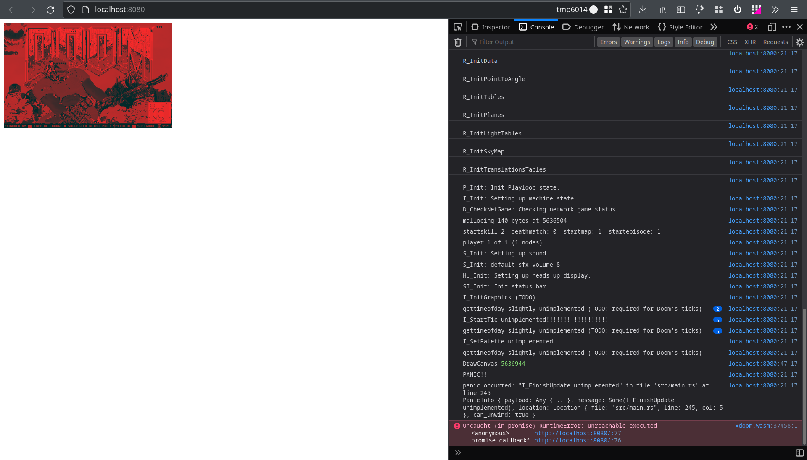
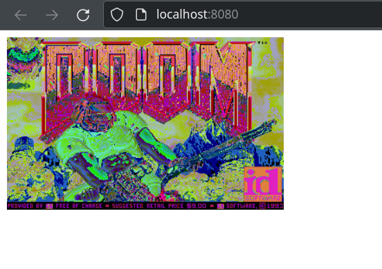
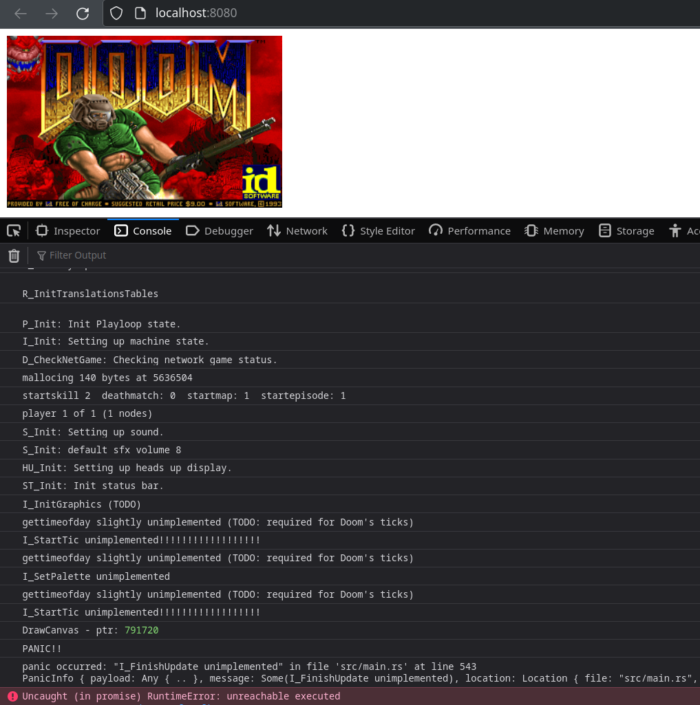

# Porting Linux DOOM to WebAssembly

We got vanilla Linux DOOM starting from Rust.

---

## libc

Getting musl

`AR=llvm-ar-10 CC=clang CFLAGS="-m32 --target=wasm32" ./configure --target=wasm32`

no `wasm32` arch support

Getting the arch from https://github.com/emscripten-core/emscripten/tree/efede793113ce1aa4d38d4f2df08e6b251cc53c6/system/lib/libc/musl/arch/emscripten

Throwing out everything which is complicated.

Crossover of musl 1.2.2 and arch from emscripten of musl 1.1.15.

Only need the string formatting functions anyway. Kicking out everything else.

Only making `make lib/libc.a`.

## compiler rt for builtins

From: https://compiler-rt.llvm.org/
> For example, when compiling for a 32-bit target, converting a double to a
> 64-bit unsigned integer is compiling into a runtime call to the "__fixunsdfdi"
> function.

https://00f.net/2019/04/07/compiling-to-webassembly-with-llvm-and-clang/
provides a precompiled `libclang_rt.builtins-wasm32.a`, which brings down the
missing imports to 51. The result looks very promising. But I want to build a
minimal version myself.

Get https://github.com/llvm/llvm-project/
`llvm-project/compiler-rt/lib/builtins` sources and compile myself. No need for
arch I hope, no assembly to be emitted. But using git tag `llvmorg-11.1.0`.

---

Dat feel! After so much theory and no way to test. Finally seeing the first
screen of Doom rendered. Awesome!

Doom rendering broken colors, but can read text:

Start screen rendering correctly on an HTML5 canvas:

We mapped Doom's X11 ColorMap to canvas's RGBA color:

---

If I don't make `I_FinishUpdate` `panic!()`, then Doom runs in its infinite game
loop. Unfortunately, this runs at 100% CPU, Firefox complains that a website is
misbehaving, and nothing is rendered, since the browser has no chance of drawing
the animation.

Probably, I want to change Doom such that doom itself is not looping, but I can
call the loop via `window.requestAnimationFrame()`.

This somehow inverses control and gives the browser a chance to render the
frames.

## Project Structure

A summary of the directory structure:
- `build.rs`: Rust build script. Tells the rust compiler to build and link to
  our small libc, compiler runtime, and doom library.
- `clang_compiler_rt`: C compiler runtime, to compile as static archive.
- `musl-1.2.2`: libc for C string functions, to compile as static archive.
- `linuxdoom-1.10`: original doom sources, to compile as static archive.
- `doom1.wad`: Doom game file.
- `src`: Rust sources.
- `index.html`: HTML and Javascript to load the compiled WebAssembly and provide
  keyboard input and HTML5 canvas rendering output.

## Optimizations

There is more to optimize for web-native performance.

The firefox performance profiler says we spend most of our time in
`gettimeofday`. In
[b1eab74](https://github.com/cedrickchee/wasm-doom/commit/b1eab74c60776ced95a28d305a16103a0e23c8e7),
we remove this implementation completely, avoiding the need to construct a
`Date` object in javascript and avoiding sedond and microsecond translation,
since Doom just cares about the milliseconds since the start of the game, which
happens to be what javascript's `performance.now()` provides.

The game runs at ~35 FPS on my machine, but Chrome performance debugging tools
still show many dropped frames, since the browser wants to animate at 60 FPS. In
addition, since Doom is still polling the time to know when it can proceed, this
is super energy inefficient and gives the browser no room for background tasks,
such as garbage collection. In
[a048af0](https://github.com/cedrickchee/wasm-doom/commit/18153c7a048af07a772e54675feb35c349ac0437),
we make Doom to return immediately when running one step of its game loop if
there is nothing to do, giving control back to the browser. Now, Doom still runs
at ~35 FPS (this is what Doom was designed for), but the browser gets a chance
to render its 60 animation frames per second and the system is mostly idle
otherwise. I can clearly hear the difference, since my CPU fan is no longer
spinning up when starting Doom.

---

Now go to https://cedrickchee.github.io/wasm-doom and start shooting monsters!